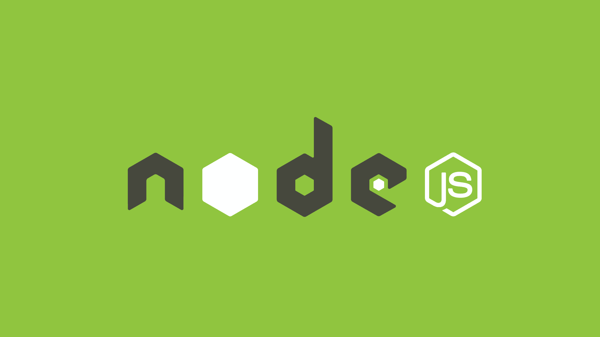

# API teste
 

> NodeJS

API de teste feita para estudo pessoal, com rotas simples, métodos HTTP e o básico de NodeJS.

## 👋 Softwares para visualização

- Insomnia (Visualizar métodos HTTP)

## 🚀 Tecnologias

- Javascript
- NodeJS
- Express
- Nodemon 
- Git e Github

## 📞 Contato

>rafael.loren175@gmail.com

>+55 (11) 99959-9140

## 👾 Discord

>rafas#7622